# La Liga 2015/16 — Tactical & Performance Analysis

## Project Overview
An end-to-end football analytics project using StatsBomb open event data.
Focused on Barcelona and Real Madrid's 2015/16 La Liga season — the peak
of the Messi vs Ronaldo era. Extracts tactical and performance insights
from 272,000+ match events across 74 matches.

## Key Questions Answered
- Who was the more efficient shooter — Messi or Ronaldo?
- Which players drove the ball forward most progressively?
- How did Barcelona and Real Madrid's passing networks differ?
- Where on the pitch were Messi and Ronaldo most active?
- How do team-level KPIs compare in an interactive dashboard?

## Analyses Performed

| Analysis | Description |
|---|---|
| xG Analysis | Expected Goals for top players across 74 matches |
| Shot Maps | Individual shot locations with xG bubble sizing |
| Pass Completion | Accurate pass % for all players with 100+ passes |
| Progressive Passes | Players advancing the ball 10+ yards forward |
| Pass Networks | Top 11 player connections by team |
| Activity Heatmaps | Pitch zones where Messi and Ronaldo operated |
| Power BI Dashboard | 4-page interactive dashboard with KPIs and filters |

## Key Findings
- **Ronaldo** took more shots (228 vs 158) and scored more goals (35 vs 26)
- **Messi** was more efficient — outperformed his xG by 4.74 goals vs Ronaldo's 3.03
- **Suárez** was the season's biggest overperformer — scored 12 goals above his xG
- **Toni Kroos** had the highest pass completion rate among Real Madrid players (91.3%)
- **Mascherano** led all players with 988 progressive passes
- **Messi** operated deeper and centrally. **Ronaldo** dominated the left wing

## Power BI Dashboard
An interactive 4-page dashboard built on exported StatsBomb data:

| Page | Content |
|---|---|
| Team Overview | Goals, xG, Shots, Pass Completion KPIs by team |
| Player Analysis | Messi vs Ronaldo comparison, top shooters, top passers |
| Advanced Analytics | Python-generated heatmaps, shot maps, pass networks |
| Key Insights | Tactical findings and recruitment recommendations |

## Visualizations Preview

### Power BI Dashboard

#### Team Overview
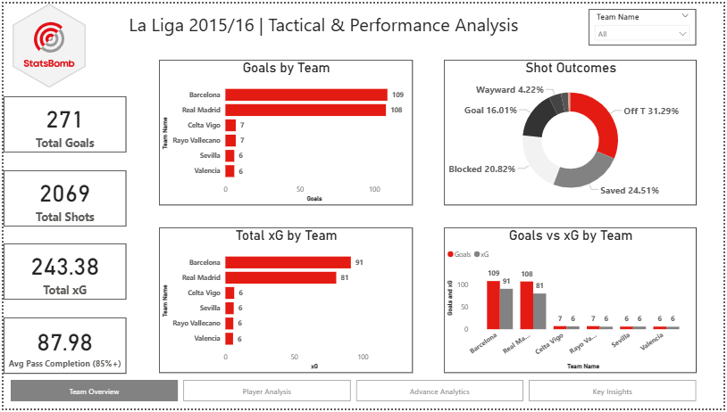

#### Player Analysis
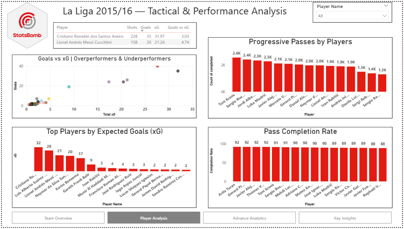

#### Advanced Analytics
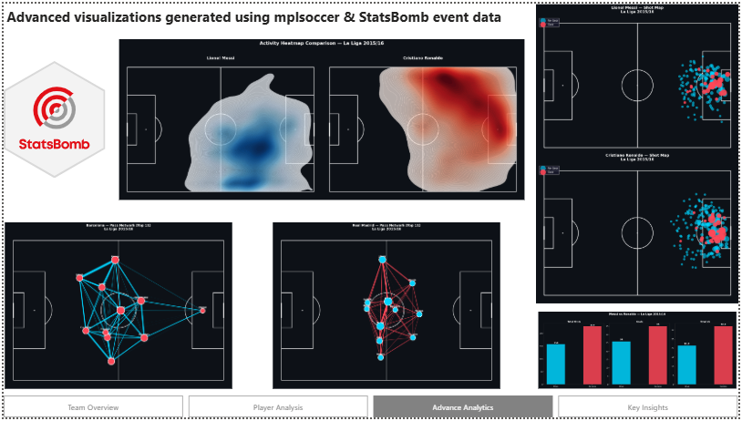

#### Key Insights
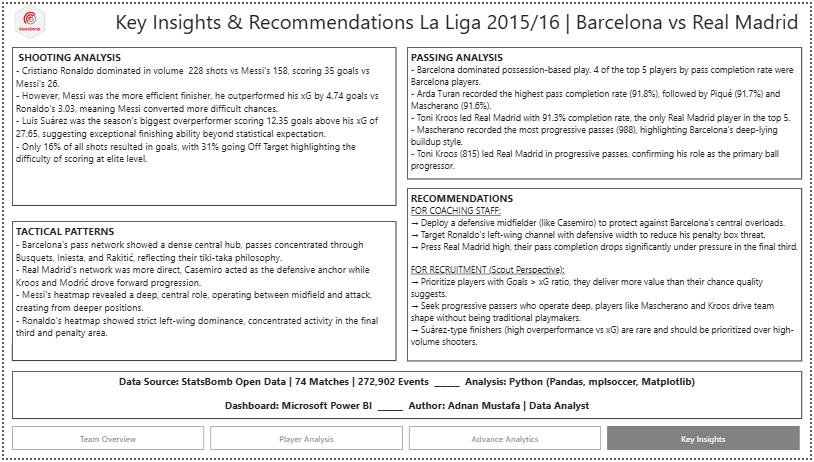

---

### Python Visualizations

#### Activity Heatmap Comparison — Messi vs Ronaldo
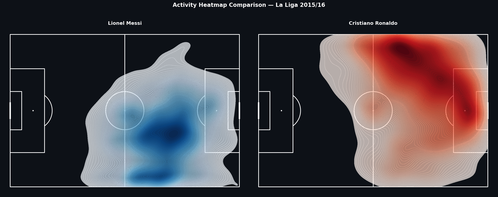

#### Lionel Messi — Activity Heatmap
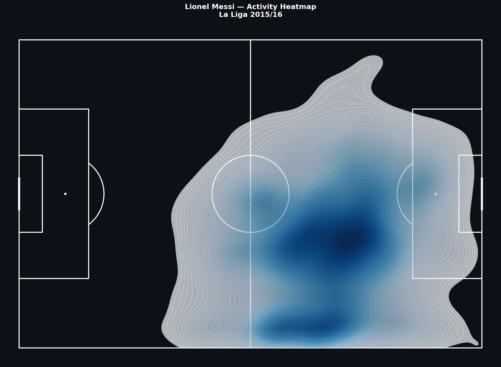

#### Cristiano Ronaldo — Activity Heatmap
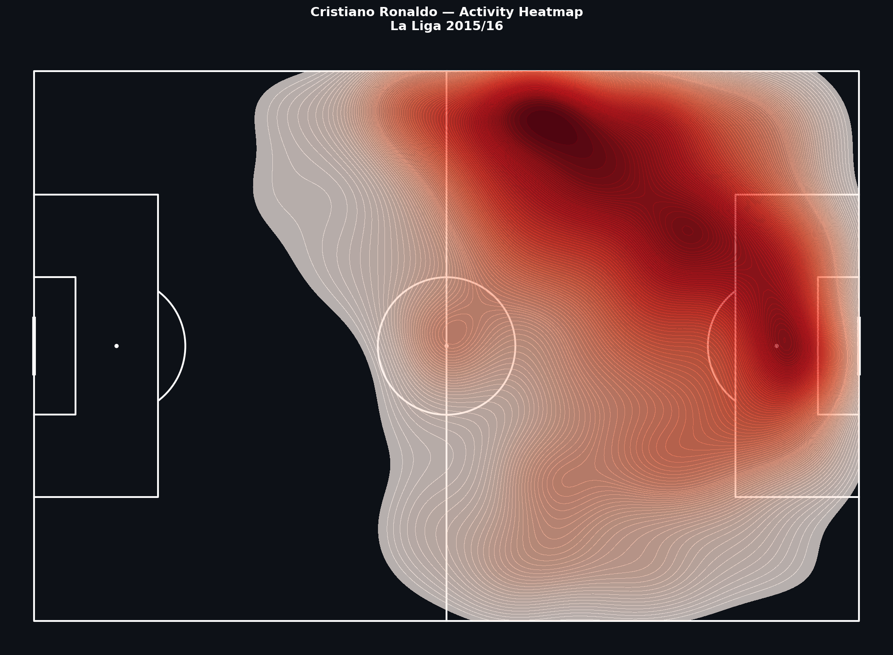

#### Barcelona Pass Network
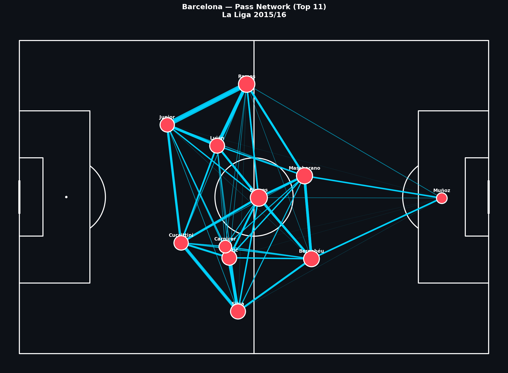

#### Real Madrid Pass Network
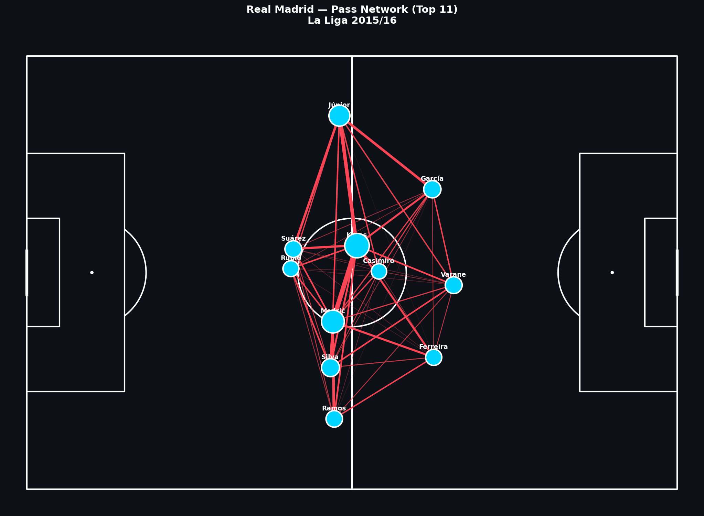

#### Messi vs Ronaldo — Head to Head
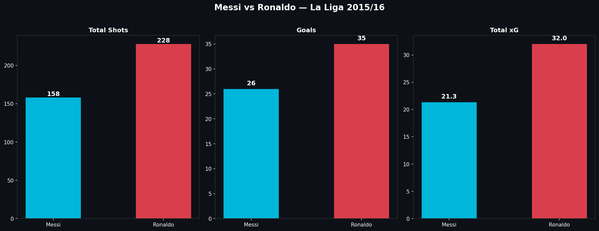

#### Cristiano Ronaldo — Shot Map
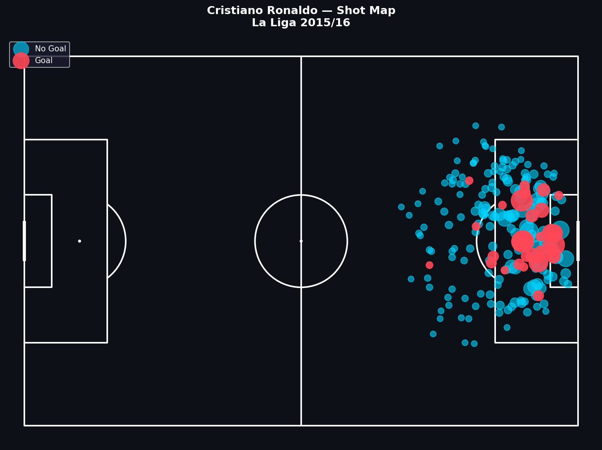

#### Lionel Messi — Shot Map
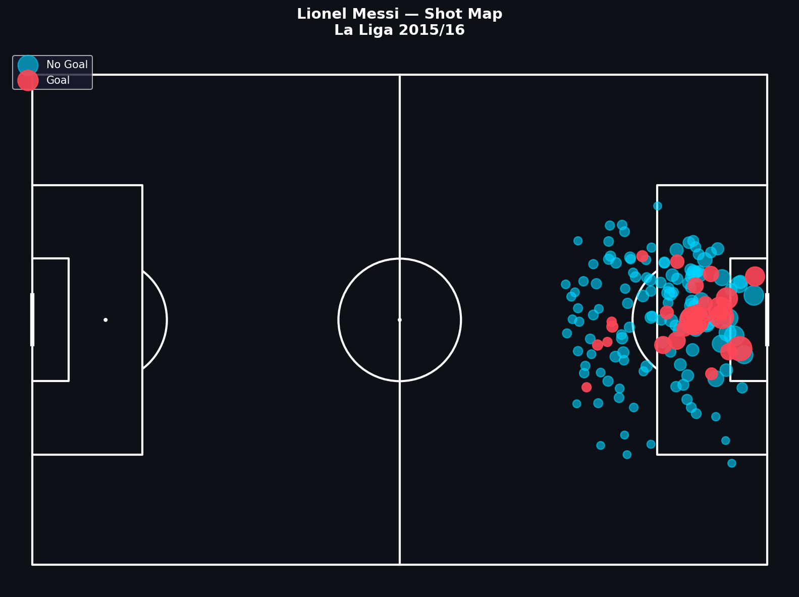

#### Expected Goals (xG) — Top Players
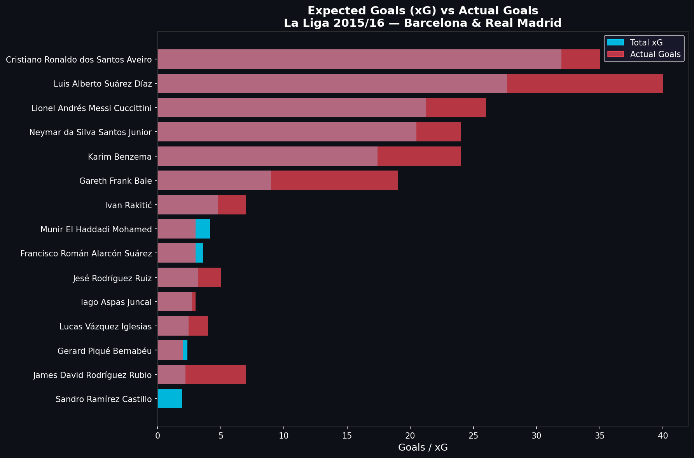

#### Pass Completion Rate
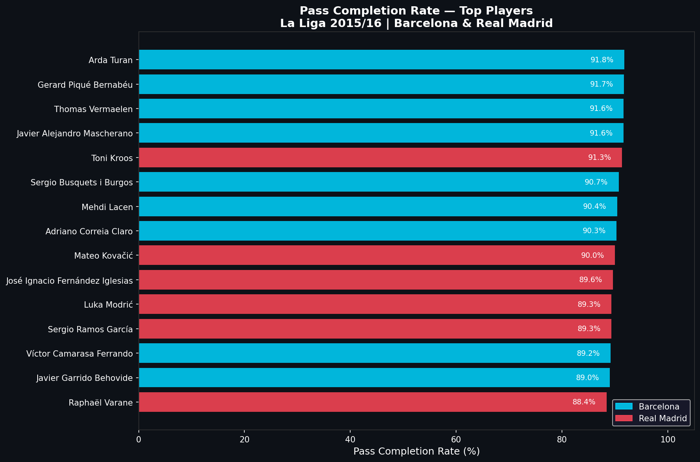

#### Progressive Passes
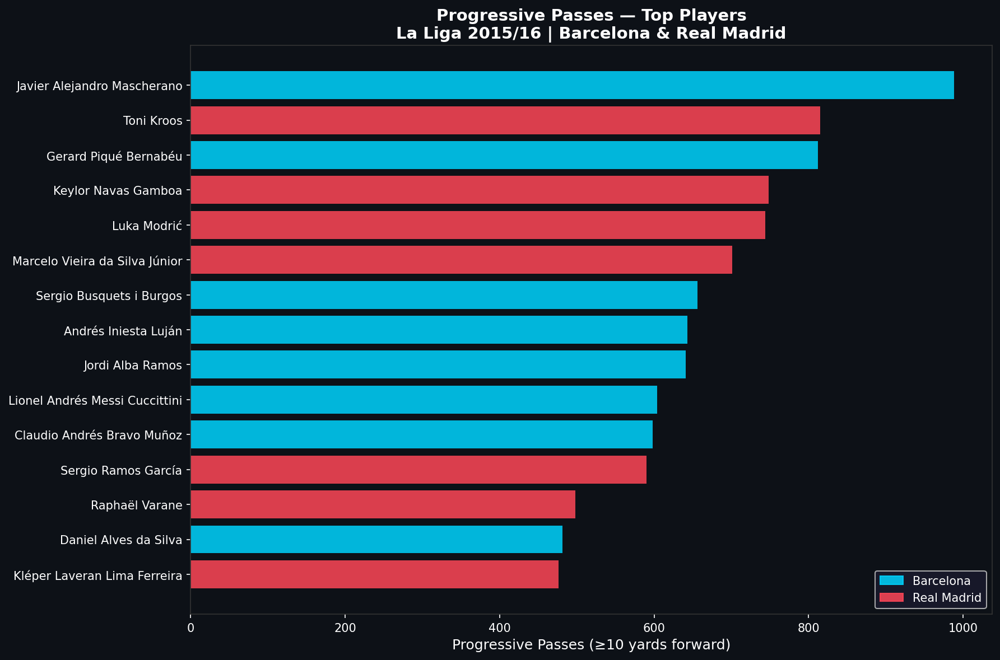

## Tools & Libraries
- Python, Pandas, NumPy
- Matplotlib, Seaborn
- mplsoccer (pitch visualizations)
- StatsBomb Open Data (74 matches, 272,902 events)
- Microsoft Power BI (Interactive Dashboard)

## Project Structure
La-Liga-Analytics/
│
├── python/
│   └── La_Liga_2015_16_Analysis.ipynb   # Main Python notebook
├── assets/                               # All visualizations
│   ├── team_overview.png
│   ├── player_analysis.png
│   ├── advance_analytics.png
│   ├── key_insights.png
│   ├── heatmap_comparison.png
│   ├── messi_heatmap.png
│   ├── cr7_heatmap.png
│   ├── barca_pass_network.png
│   ├── rm_pass_network.png
│   ├── messi_vs_cr7.png
│   ├── messi_shot_map.png
│   ├── cr7_shot_map.png
│   ├── xg_top_players.png
│   ├── pass_completion.png
│   └── progressive_passes.png
└── data/                                 # Exported CSV files
├── shots_data.csv
├── passes_data.csv
├── xg_summary.csv
└── pass_summary.csv

## Data Source
StatsBomb Open Data — [github.com/statsbomb/open-data](https://github.com/statsbomb/open-data)

*Data provided free for public research. Please credit StatsBomb when sharing.*
